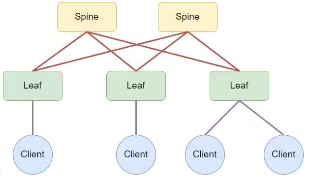
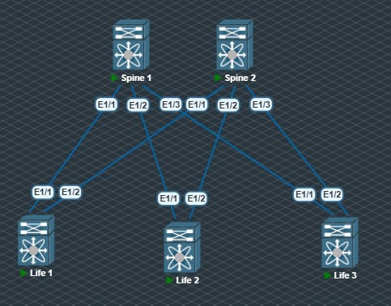
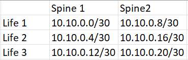

# Проектирование адресного пространства 

### Цель: распределить адресное пространсво для Underlay сети




В качестве лифов и спайнов были взяты Cisco Nexus схема была воссоздана в лабораторных условиях:


## Планирование адресации 
Сеть для Lo Spine -	10.0.1.0/24

Сеть для Lo Life  -	10.1.0.0/24

Сеть для p2p  -	10.10.0.0/16


Линки p2p: 



Выполненные настройки на Spine 1:
```sh
interface loopback1
  ip address 10.0.1.1/32

interface Ethernet1/1
  no switchport
  ip address 10.10.0.1/30
  no shutdown

interface Ethernet1/2
  no switchport
  ip address 10.10.0.5/30
  no shutdown

interface Ethernet1/3
  no switchport
  ip address 10.10.0.13/30
  no shutdown
```
 
На втором выполнены аналогичные настройки в соответствии с планом адресации и p2p линков.

Настройки для Life 1:
```sh
interface loopback1
  ip address 10.1.0.1/32

interface Ethernet1/1
  no switchport
  ip address 10.10.0.2/30
  no shutdown

interface Ethernet1/2
  no switchport
  ip address 10.10.0.10/30
  no shutdown
```
На остальных выполнены аналогичные настройки в соответствии с планом адресации.

Настройки адресации выполнены.
```sh
Life1# ping 10.10.0.1
PING 10.10.0.1 (10.10.0.1): 56 data bytes
64 bytes from 10.10.0.1: icmp_seq=0 ttl=254 time=19.276 ms
64 bytes from 10.10.0.1: icmp_seq=1 ttl=254 time=16.375 ms
64 bytes from 10.10.0.1: icmp_seq=2 ttl=254 time=16.813 ms
64 bytes from 10.10.0.1: icmp_seq=3 ttl=254 time=17.277 ms
64 bytes from 10.10.0.1: icmp_seq=4 ttl=254 time=20.779 ms

--- 10.10.0.1 ping statistics ---
5 packets transmitted, 5 packets received, 0.00% packet loss
round-trip min/avg/max = 16.375/18.103/20.779 ms
```
Аналогично Ping проходит на всех остальных линках, пинга между lo интерфейсами нет, так как пока что не настроена маршрутизация.
