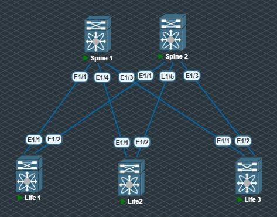

# Underlay. OSPF

### Цель: Настроить OSPF для Underlay сети.

Между коммутаторами p2p линки были переделаны на /31 для разнообразия, а так же для экономии адресного пространства.



Адреса лупбэк интерфейсов остались прежними.
Бли выполнены настроки OSPF(на примере Spine1):
```sh
feature ospf

router ospf 10
  router-id 10.0.1.1

interface Ethernet1/1
  no switchport
  ip address 10.10.0.1/31
  ip ospf network point-to-point
  ip router ospf 10 area 0.0.0.0
  no shutdown

interface Ethernet1/2
  no switchport
  ip address 10.10.0.5/31
  ip ospf network point-to-point
  ip router ospf 10 area 0.0.0.0
  no shutdown

interface Ethernet1/3
  no switchport
  ip address 10.10.0.9/31
  ip ospf network point-to-point
  ip router ospf 10 area 0.0.0.0
  no shutdown

interface loopback1
  ip address 10.0.1.1/32
  ip router ospf 10 area 0.0.0.0
```

Аналогичнные настроки были выпонен на всех устройствах.

Теперть табдица марщрутизации на устройствах выглядит следующим образом:
```sh
Life2# sh ip route 
IP Route Table for VRF "default"
'*' denotes best ucast next-hop
'**' denotes best mcast next-hop
'[x/y]' denotes [preference/metric]
'%<string>' in via output denotes VRF <string>

10.0.1.1/32, ubest/mbest: 1/0
    *via 10.10.0.41, Eth1/1, [110/41], 00:09:54, ospf-10, intra
10.0.1.2/32, ubest/mbest: 1/0
    *via 10.10.0.51, Eth1/2, [110/41], 00:04:25, ospf-10, intra
10.1.0.1/32, ubest/mbest: 2/0
    *via 10.10.0.41, Eth1/1, [110/81], 01:15:09, ospf-10, intra
    *via 10.10.0.51, Eth1/2, [110/81], 01:15:09, ospf-10, intra
10.1.0.2/32, ubest/mbest: 2/0, attached
    *via 10.1.0.2, Lo1, [0/0], 01:18:09, local
    *via 10.1.0.2, Lo1, [0/0], 01:18:09, direct
10.1.0.3/32, ubest/mbest: 2/0
    *via 10.10.0.41, Eth1/1, [110/81], 00:02:52, ospf-10, intra
    *via 10.10.0.51, Eth1/2, [110/81], 00:02:52, ospf-10, intra
10.10.0.0/31, ubest/mbest: 1/0
    *via 10.10.0.41, Eth1/1, [110/80], 01:17:14, ospf-10, intra
10.10.0.2/31, ubest/mbest: 1/0
    *via 10.10.0.51, Eth1/2, [110/80], 01:15:09, ospf-10, intra
10.10.0.4/31, ubest/mbest: 1/0
    *via 10.10.0.41, Eth1/1, [110/80], 01:17:14, ospf-10, intra
10.10.0.6/31, ubest/mbest: 1/0
    *via 10.10.0.51, Eth1/2, [110/80], 01:15:09, ospf-10, intra
10.10.0.8/31, ubest/mbest: 1/0
    *via 10.10.0.41, Eth1/1, [110/80], 01:17:14, ospf-10, intra
10.10.0.14/31, ubest/mbest: 1/0
    *via 10.10.0.51, Eth1/2, [110/80], 01:15:09, ospf-10, intra
10.10.0.20/31, ubest/mbest: 1/0
    *via 10.10.0.51, Eth1/2, [110/80], 01:15:09, ospf-10, intra
10.10.0.40/31, ubest/mbest: 1/0, attached
    *via 10.10.0.40, Eth1/1, [0/0], 01:22:55, direct
10.10.0.40/32, ubest/mbest: 1/0, attached
    *via 10.10.0.40, Eth1/1, [0/0], 01:22:55, local
10.10.0.50/31, ubest/mbest: 1/0, attached
    *via 10.10.0.50, Eth1/2, [0/0], 01:22:17, direct
10.10.0.50/32, ubest/mbest: 1/0, attached
    *via 10.10.0.50, Eth1/2, [0/0], 01:22:17, local
```

Видим что получили маршруты по OSPF.

Проверим связность:
```sh
Life2# ping 10.1.0.1
PING 10.1.0.1 (10.1.0.1): 56 data bytes
64 bytes from 10.1.0.1: icmp_seq=0 ttl=253 time=40.998 ms
64 bytes from 10.1.0.1: icmp_seq=1 ttl=253 time=38.268 ms
64 bytes from 10.1.0.1: icmp_seq=2 ttl=253 time=40.199 ms
64 bytes from 10.1.0.1: icmp_seq=3 ttl=253 time=30.519 ms
64 bytes from 10.1.0.1: icmp_seq=4 ttl=253 time=28.795 ms

--- 10.1.0.1 ping statistics ---
5 packets transmitted, 5 packets received, 0.00% packet loss
round-trip min/avg/max = 28.795/35.755/40.998 ms
Life2# 
Life2# 
Life2# ping 10.1.0.3
PING 10.1.0.3 (10.1.0.3): 56 data bytes
64 bytes from 10.1.0.3: icmp_seq=0 ttl=253 time=33.474 ms
64 bytes from 10.1.0.3: icmp_seq=1 ttl=253 time=28.296 ms
64 bytes from 10.1.0.3: icmp_seq=2 ttl=253 time=29.475 ms
64 bytes from 10.1.0.3: icmp_seq=3 ttl=253 time=38.423 ms
64 bytes from 10.1.0.3: icmp_seq=4 ttl=253 time=35.597 ms

--- 10.1.0.3 ping statistics ---
5 packets transmitted, 5 packets received, 0.00% packet loss
round-trip min/avg/max = 28.296/33.052/38.423 ms
Life2# 
Life2# 
Life2# ping 10.0.1.1
PING 10.0.1.1 (10.0.1.1): 56 data bytes
64 bytes from 10.0.1.1: icmp_seq=0 ttl=254 time=18.959 ms
64 bytes from 10.0.1.1: icmp_seq=1 ttl=254 time=20.997 ms
64 bytes from 10.0.1.1: icmp_seq=2 ttl=254 time=21.77 ms
64 bytes from 10.0.1.1: icmp_seq=3 ttl=254 time=38.698 ms
64 bytes from 10.0.1.1: icmp_seq=4 ttl=254 time=16.073 ms

--- 10.0.1.1 ping statistics ---
5 packets transmitted, 5 packets received, 0.00% packet loss
round-trip min/avg/max = 16.073/23.299/38.698 ms
Life2# ping 10.0.1.2
PING 10.0.1.2 (10.0.1.2): 56 data bytes
64 bytes from 10.0.1.2: icmp_seq=0 ttl=254 time=15.384 ms
64 bytes from 10.0.1.2: icmp_seq=1 ttl=254 time=24.935 ms
64 bytes from 10.0.1.2: icmp_seq=2 ttl=254 time=18.305 ms
64 bytes from 10.0.1.2: icmp_seq=3 ttl=254 time=26.925 ms
64 bytes from 10.0.1.2: icmp_seq=4 ttl=254 time=28.153 ms

--- 10.0.1.2 ping statistics ---
5 packets transmitted, 5 packets received, 0.00% packet loss
round-trip min/avg/max = 15.384/22.74/28.153 ms
```


Видим что с Life2 доступны все лупбэки наших коммутаторов.

Цель достигнута успешно:)

