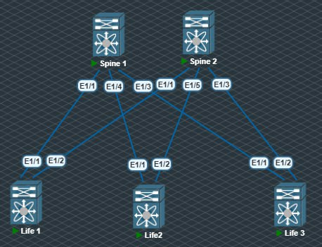

# Underlay. IS-IS

### Цель: настроить IS-IS для Underlay сети.

Топология не изменилоась:


Настройки выполненные на Spine1:
```sh 
interface Ethernet1/1
  no switchport
  ip address 10.10.0.1/31
  ip router isis 10
  no shutdown

interface Ethernet1/3
  no switchport
  ip address 10.10.0.9/31
  ip router isis 10
  no shutdown

interface Ethernet1/4
  no switchport
  ip address 10.10.0.41/31
  ip router isis 10
  no shutdown

interface loopback1
  ip address 10.0.1.1/32
  ip router isis 10

router isis 10
  net 49.0010.0000.0001.0001.00
```

Аналогичные настройки бли выполненны на всех коммутаторах.

Переходим к проерке:

Вывод команды  sh isis route
```sh
Spine1# sh isis route 
IS-IS process: 10 VRF: default
IS-IS IPv4 routing table

10.0.1.1/32, L1, direct
   *via loopback1, metric 1, L1, direct
    via loopback1, metric 1, L2, direct
10.0.1.2/32, L1
   *via 10.10.0.0, Ethernet1/1, metric 81, L1 (I,U), table-map-deny no-pol, admi
n-dist 115
   *via 10.10.0.40, Ethernet1/4, metric 81, L1 (I,U), table-map-deny no-pol, adm
in-dist 115
   *via 10.10.0.8, Ethernet1/3, metric 81, L1 (I,U), table-map-deny no-pol, admi
n-dist 115
    via 10.10.0.0, Ethernet1/1, metric 81, L2 (I,U), table-map-deny no-pol, admi
n-dist 0
    via 10.10.0.40, Ethernet1/4, metric 81, L2 (I,U), table-map-deny no-pol, adm
in-dist 0
    via 10.10.0.8, Ethernet1/3, metric 81, L2 (I,U), table-map-deny no-pol, admi
n-dist 0
10.1.0.1/32, L1
   *via 10.10.0.0, Ethernet1/1, metric 41, L1 (I,U), table-map-deny no-pol, admi
n-dist 115
    via 10.10.0.0, Ethernet1/1, metric 41, L2 (I,U), table-map-deny no-pol, admi
n-dist 0
10.1.0.2/32, L1
   *via 10.10.0.40, Ethernet1/4, metric 41, L1 (I,U), table-map-deny no-pol, adm
in-dist 115
    via 10.10.0.40, Ethernet1/4, metric 41, L2 (I,U), table-map-deny no-pol, adm
in-dist 0
10.1.0.3/32, L1
   *via 10.10.0.8, Ethernet1/3, metric 41, L1 (I,U), table-map-deny no-pol, admi
n-dist 115
    via 10.10.0.8, Ethernet1/3, metric 41, L2 (I,U), table-map-deny no-pol, admi
n-dist 0
10.10.0.0/31, L1, direct
   *via Ethernet1/1, metric 40, L1, direct
    via Ethernet1/1, metric 40, L2, direct
10.10.0.2/31, L1
   *via 10.10.0.0, Ethernet1/1, metric 80, L1 (I,U), table-map-deny no-pol, admi
n-dist 115
    via 10.10.0.0, Ethernet1/1, metric 80, L2 (I,U), table-map-deny no-pol, admi
n-dist 0
10.10.0.4/31, L1, direct
   *via Ethernet1/2, metric 40, L1, direct
    via Ethernet1/2, metric 40, L2, direct
10.10.0.6/31, L1
   *via 10.10.0.8, Ethernet1/3, metric 80, L1 (I,U), table-map-deny no-pol, admi
n-dist 115
    via 10.10.0.8, Ethernet1/3, metric 80, L2 (I,U), table-map-deny no-pol, admi
n-dist 0
10.10.0.8/31, L1, direct
   *via Ethernet1/3, metric 40, L1, direct
    via Ethernet1/3, metric 40, L2, direct
10.10.0.40/31, L1, direct
   *via Ethernet1/4, metric 40, L1, direct
    via Ethernet1/4, metric 40, L2, direct
10.10.0.50/31, L1
   *via 10.10.0.40, Ethernet1/4, metric 80, L1 (I,U), table-map-deny no-pol, adm
in-dist 115
    via 10.10.0.40, Ethernet1/4, metric 80, L2 (I,U), table-map-deny no-pol, adm
in-dist 0
```

Вывод команды - sh isis   hostname:
 ```sh
 Spine1# sh isis   hostname 
IS-IS Process: 10 dynamic hostname table VRF: default
  Level  System ID       Dynamic hostname
  1      0000.0001.0001* Spine1
  1      0000.0001.0002  Spine2
  1      0001.0000.0001  Life1
  1      0001.0000.0002  Life2
  1      0001.0000.0003  Life3
 ```

 Ping c Life1 доходит до всех:
 ```sh
Life1# ping 10.1.0.2
PING 10.1.0.2 (10.1.0.2): 56 data bytes
64 bytes from 10.1.0.2: icmp_seq=0 ttl=253 time=44.06 ms
64 bytes from 10.1.0.2: icmp_seq=1 ttl=253 time=35.909 ms
64 bytes from 10.1.0.2: icmp_seq=2 ttl=253 time=39.304 ms
64 bytes from 10.1.0.2: icmp_seq=3 ttl=253 time=52.268 ms
64 bytes from 10.1.0.2: icmp_seq=4 ttl=253 time=32.433 ms

--- 10.1.0.2 ping statistics ---
5 packets transmitted, 5 packets received, 0.00% packet loss
round-trip min/avg/max = 32.433/40.794/52.268 ms
Life1# ping 10.1.0.3
PING 10.1.0.3 (10.1.0.3): 56 data bytes
64 bytes from 10.1.0.3: icmp_seq=0 ttl=253 time=56.02 ms
64 bytes from 10.1.0.3: icmp_seq=1 ttl=253 time=40.769 ms
64 bytes from 10.1.0.3: icmp_seq=2 ttl=253 time=40.819 ms
64 bytes from 10.1.0.3: icmp_seq=3 ttl=253 time=52.499 ms
64 bytes from 10.1.0.3: icmp_seq=4 ttl=253 time=45.179 ms

--- 10.1.0.3 ping statistics ---
5 packets transmitted, 5 packets received, 0.00% packet loss
round-trip min/avg/max = 40.769/47.057/56.02 ms
Life1# ping 10.0.1.1
PING 10.0.1.1 (10.0.1.1): 56 data bytes
64 bytes from 10.0.1.1: icmp_seq=0 ttl=254 time=20.947 ms
64 bytes from 10.0.1.1: icmp_seq=1 ttl=254 time=17.526 ms
64 bytes from 10.0.1.1: icmp_seq=2 ttl=254 time=18.942 ms
64 bytes from 10.0.1.1: icmp_seq=3 ttl=254 time=21.326 ms
64 bytes from 10.0.1.1: icmp_seq=4 ttl=254 time=30.99 ms

--- 10.0.1.1 ping statistics ---
5 packets transmitted, 5 packets received, 0.00% packet loss
round-trip min/avg/max = 17.526/21.946/30.99 ms
Life1# ping 10.0.1.2
PING 10.0.1.2 (10.0.1.2): 56 data bytes
64 bytes from 10.0.1.2: icmp_seq=0 ttl=254 time=45.388 ms
64 bytes from 10.0.1.2: icmp_seq=1 ttl=254 time=34.842 ms
64 bytes from 10.0.1.2: icmp_seq=2 ttl=254 time=36.74 ms
64 bytes from 10.0.1.2: icmp_seq=3 ttl=254 time=47.47 ms
64 bytes from 10.0.1.2: icmp_seq=4 ttl=254 time=36.664 ms

--- 10.0.1.2 ping statistics ---
5 packets transmitted, 5 packets received, 0.00% packet loss
round-trip min/avg/max = 34.842/40.22/47.47 ms
 ```

 Цели считаю достигнутыми.