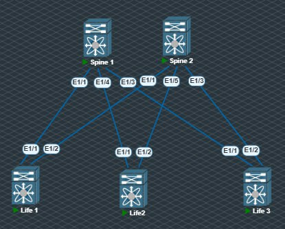

# Underlay. BGP

### Цель: настроить BGP для Underlay сети.

Топология не изменилоась:


Настройки выполненные на Spine1:
```sh 
route-map LIFE permit 10
  match as-number 6501-6510

router bgp 6500
  router-id 10.0.1.1
  reconnect-interval 12
  log-neighbor-changes
  address-family ipv4 unicast
  neighbor 10.10.0.0/24 remote-as route-map LIFE
    address-family ipv4 unicast
```
Абсолютно аналогичные настройки выполнены на втором спайне, за исключением router-id.

Настройкки выполныненные лифе:
```sh 
ip prefix-list LO seq 5 permit 10.1.0.1/32
route-map LO permit 10
  match ip address prefix-list

router bgp 6501
  router-id 10.1.0.1
  reconnect-interval 12
  log-neighbor-changes
  address-family ipv4 unicast
    redistribute direct route-map LO
  template peer SPINE
    remote-as 6500
    timers 3 9
    address-family ipv4 unicast
  neighbor 10.10.0.1
    inherit peer SPINE
  neighbor 10.10.0.3
    inherit peer SPINE
```

Аналогично выполненно на остальных.

Переходим к проверке:

```sh 
Life1# sh ip bgp summary
BGP summary information for VRF default, address family IPv4 Unicast
BGP router identifier 10.1.0.1, local AS number 6501
BGP table version is 47, IPv4 Unicast config peers 2, capable peers 2
2 network entries and 3 paths using 604 bytes of memory
BGP attribute entries [2/320], BGP AS path entries [1/10]
BGP community entries [0/0], BGP clusterlist entries [0/0]

Neighbor        V    AS MsgRcvd MsgSent   TblVer  InQ OutQ Up/Down  State/PfxRcd
10.10.0.1       4  6500   10805   10816       47    0    0 08:36:38 1
10.10.0.3       4  6500   10906   10900       47    0    0 08:38:54 1
```

```sh
Life1# ping 10.1.0.3 source 10.1.0.1
PING 10.1.0.3 (10.1.0.3) from 10.1.0.1: 56 data bytes
64 bytes from 10.1.0.3: icmp_seq=0 ttl=253 time=44.739 ms
64 bytes from 10.1.0.3: icmp_seq=1 ttl=253 time=39.335 ms
64 bytes from 10.1.0.3: icmp_seq=2 ttl=253 time=33.794 ms
64 bytes from 10.1.0.3: icmp_seq=3 ttl=253 time=36.835 ms
64 bytes from 10.1.0.3: icmp_seq=4 ttl=253 time=29.51 ms

--- 10.1.0.3 ping statistics ---
5 packets transmitted, 5 packets received, 0.00% packet loss
round-trip min/avg/max = 29.51/36.842/44.739 ms
```

Лупбэк адреса между собой пингуются, цели считаю достигнутыми :)