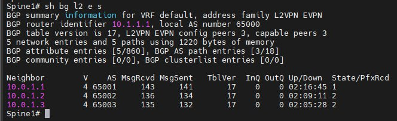
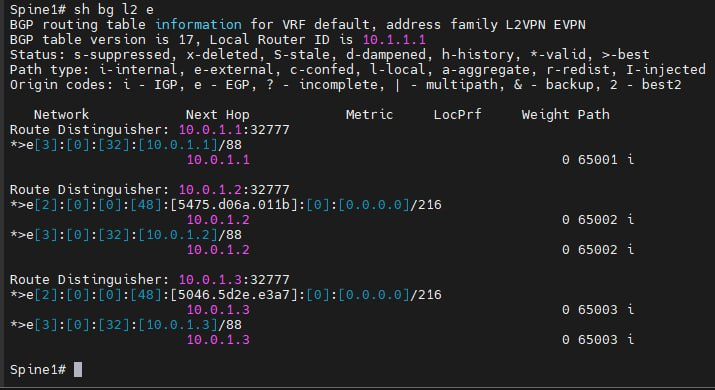
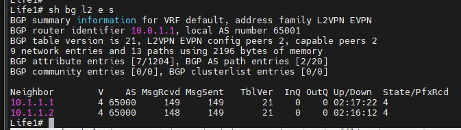
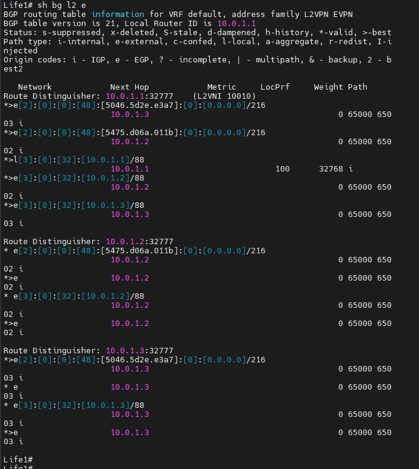
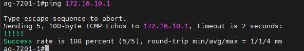
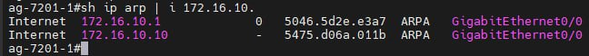
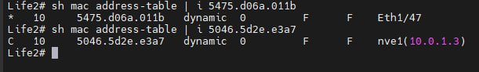

# VxLAN. L2 VNI

### Настроить Overlay на основе VxLAN EVPN для L2 связанности между клиентами.

В качестве underlay будем использовать протокл OSPF.

Топология неизменна:


Добавил несколько клиентов.

Будем обмениться информацией из vlan 10, клиентская сеть будет использоваться 172.16.10.0/24

Приступаем к настройке: 

Конфигурация спайнов:
```sh
feature ngmvpn
nv overlay evpn
feature ospf
feature bgp
feature interface-vlan
feature vn-segment-vlan-based
feature nv overlay

route-map NH_UNCHANGED permit 10
  set ip next-hop unchanged

vlan 100
  vn-segment 10100

interface nve1
  no shutdown
  host-reachability protocol bgp
  source-interface loopback0
  member vni 1010
    ingress-replication protocol bgp
  member vni 10100 associate-vrf

interface Ethernet1/1
  description to_Life1
  no switchport
  ip address 10.0.0.0/31
  ip ospf network point-to-point
  ip router ospf 1 area 0.0.0.0
  no shutdown

interface Ethernet1/3
  description to_Life2
  no switchport
  ip address 10.0.0.2/31
  ip ospf network point-to-point
  ip router ospf 1 area 0.0.0.0
  no shutdown


interface Ethernet1/5
  description to_life3
  no switchport
  ip address 10.0.0.4/31
  ip ospf network point-to-point
  ip router ospf 1 area 0.0.0.0
  no shutdown

interface loopback0
  ip address 10.1.1.1/32
  ip ospf network point-to-point
  ip router ospf 1 area 0.0.0.0

boot nxos bootflash:/nxos.9.3.13.bin
router ospf 1
  router-id 10.1.1.1
  
router bgp 65000
  router-id 10.1.1.1
  address-family l2vpn evpn
    maximum-paths 10
    retain route-target all
  neighbor 10.0.1.1
    remote-as 65001
    update-source loopback0
    ebgp-multihop 5
    address-family l2vpn evpn
      send-community
      send-community extended
      route-map NH_UNCHANGED out
      rewrite-evpn-rt-asn
  neighbor 10.0.1.2
    remote-as 65002
    update-source loopback0
    ebgp-multihop 5
    address-family l2vpn evpn
      send-community
      send-community extended
      route-map NH_UNCHANGED out
      rewrite-evpn-rt-asn
  neighbor 10.0.1.3
    remote-as 65003
    update-source loopback0
    ebgp-multihop 5
    address-family l2vpn evpn
      send-community
      send-community extended
      route-map NH_UNCHANGED out
      rewrite-evpn-rt-asn
```

Конфигурация лифов:
```sh
feature ospf
feature bgp
feature fabric forwarding
feature vn-segment-vlan-based
feature nv overlay

vlan 10
  name VLAN_10
  vn-segment 10010

interface nve1
  no shutdown
  host-reachability protocol bgp
  source-interface loopback1
  member vni 10010
    ingress-replication protocol bgp

interface Ethernet1/1
  description to_Spine1
  no switchport
  ip address 10.0.0.1/31
  ip ospf network point-to-point
  ip router ospf 1 area 0.0.0.0
  no shutdown

interface Ethernet1/3
  description to_Spine2
  no switchport
  ip address 10.0.0.11/31
  ip ospf network point-to-point
  ip router ospf 1 area 0.0.0.0
  no shutdown

interface loopback1
  ip address 10.0.1.1/32
  ip router ospf 1 area 0.0.0.0

router ospf 1
  router-id 10.0.1.1
  
router bgp 65001
  router-id 10.0.1.1
  log-neighbor-changes
  address-family l2vpn evpn
    maximum-paths 10
  template peer SPINES
    remote-as 65000
    update-source loopback1
    ebgp-multihop 10
    address-family l2vpn evpn
      send-community
      send-community extended
      rewrite-evpn-rt-asn
  neighbor 10.1.1.1
    inherit peer SPINES
  neighbor 10.1.1.2
    inherit peer SPINES
evpn
  vni 10010 l2
    rd auto
    route-target import auto
    route-target export auto
```

Проверка:

соседство поднялось

видим что маки летят


с стороны лифа 



пинг с одного клиента до второго 



Видим что на лифе клиент подклчен непосредственно, а второй мак знаем от соседа, так выглядит мак в таблице маков:


Цель зостигнута!