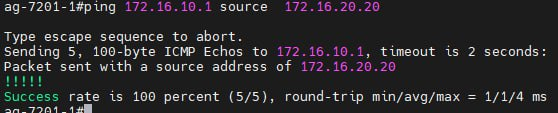

# VxLAN. L3 VNI

### Настроить маршрутизацию в рамках Overlay между клиентами в разных VNI.


В качестве underlay будем использовать протокл OSPF.

Топология неизменна:


Добавил несколько клиентов.

Настроим клиентов в разных Vlan и разных сетях.

Конфигурация спайнов не менялась с прошлой лабораторной.

Конфигурация лифов:
Например Life2
```sh
fabric forwarding anycast-gateway-mac 000e.000e.000e
vlan 1,10,20,999
vlan 10
  name VLAN_10
  vn-segment 10010
vlan 20
  vn-segment 10020
vlan 999
  vn-segment 100999

vrf context A
  vni 100999
  rd 65002:100999
  address-family ipv4 unicast
    route-target import 65000:100999
    route-target import 65000:100999 evpn
    route-target export 65000:100999
    route-target export 65000:100999 evpn

interface Vlan10
  no shutdown
  vrf member A
  ip address 172.16.10.254/24
  fabric forwarding mode anycast-gateway

interface Vlan20
  no shutdown
  vrf member A
  ip address 172.16.20.254/24
  fabric forwarding mode anycast-gateway

interface Vlan999
  no shutdown
  vrf member A
  ip forward

interface nve1
  no shutdown
  host-reachability protocol bgp
  source-interface loopback1
  member vni 10010
    ingress-replication protocol bgp
  member vni 10020
    ingress-replication protocol bgp
  member vni 100999 associate-vrf

interface Ethernet1/1
  description to_Spine1
  no switchport
  ip address 10.0.0.3/31
  ip ospf network point-to-point
  ip router ospf 1 area 0.0.0.0
  no shutdown

interface Ethernet1/3
  description to_Spine2
  no switchport
  ip address 10.0.0.9/31
  ip ospf network point-to-point
  ip router ospf 1 area 0.0.0.0
  no shutdown

interface Ethernet1/47
  switchport access vlan 20

interface loopback1
  ip address 10.0.1.2/32
  ip router ospf 1 area 0.0.0.0
line console
line vty
boot nxos bootflash:/nxos.9.3.14.bin
router ospf 1
  router-id 10.0.1.2
router bgp 65002
  router-id 10.0.1.2
  log-neighbor-changes
  address-family l2vpn evpn
    maximum-paths 10
  template peer SPINES
    remote-as 65000
    update-source loopback1
    ebgp-multihop 10
    address-family l2vpn evpn
      send-community
      send-community extended
  neighbor 10.1.1.1
    inherit peer SPINES
  neighbor 10.1.1.2
    inherit peer SPINES
evpn
  vni 10010 l2
    rd 65002:10010
    route-target import 65000:10010
    route-target export 65000:10010
  vni 10020 l2
    rd 65002:10020
    route-target import 65000:10020
    route-target export 65000:10020
```

Life3
```sh
fabric forwarding anycast-gateway-mac 000e.000e.000e
vlan 1,10,20,999
vlan 10
  name VLAN_10
  vn-segment 10010
vlan 20
  vn-segment 10020
vlan 999
  vn-segment 100999

vrf context A
  vni 100999
  rd 65003:100999
  address-family ipv4 unicast
    route-target import 65000:100999
    route-target import 65000:100999 evpn
    route-target export 65000:100999
    route-target export 65000:100999 evpn
vrf context management

interface Vlan1

interface Vlan10
  no shutdown
  vrf member A
  ip address 172.16.10.254/24
  fabric forwarding mode anycast-gateway

interface Vlan20
  no shutdown
  vrf member A
  ip address 172.16.20.254/24
  fabric forwarding mode anycast-gateway

interface Vlan999
  no shutdown
  vrf member A
  ip forward

interface nve1
  no shutdown
  host-reachability protocol bgp
  source-interface loopback1
  member vni 10010
    ingress-replication protocol bgp
  member vni 10020
    ingress-replication protocol bgp
  member vni 100999 associate-vrf

interface Ethernet1/1
  no switchport
  ip address 10.0.0.5/31
  ip ospf network point-to-point
  ip router ospf 1 area 0.0.0.0
  no shutdown

interface Ethernet1/3
  no switchport
  ip address 10.0.0.7/31
  ip ospf network point-to-point
  ip router ospf 1 area 0.0.0.0
  no shutdown

interface Ethernet1/47
  switchport access vlan 10

interface loopback1
  ip address 10.0.1.3/32
  ip router ospf 1 area 0.0.0.0
line console
line vty
boot nxos bootflash:/nxos.9.3.14.bin
router ospf 1
  router-id 10.0.1.3
router bgp 65003
  router-id 10.0.1.3
  log-neighbor-changes
  address-family l2vpn evpn
    maximum-paths 10
  template peer SPINES
    remote-as 65000
    update-source loopback1
    ebgp-multihop 10
    address-family l2vpn evpn
      send-community
      send-community extended
  neighbor 10.1.1.1
    inherit peer SPINES
  neighbor 10.1.1.2
    inherit peer SPINES
evpn
  vni 10010 l2
    rd 65003:10010
    route-target import 65000:10010
    route-target export 65000:10010
  vni 10020 l2
    rd 65003:10020
    route-target import 65000:10020
    route-target export 65000:100
```

Настроил два хоста:
172.16.10.1
172.16.20.20

Поверка работоспособности:


```sh
Life2# sh bg l2 e
BGP routing table information for VRF default, address family L2VPN EVPN
BGP table version is 169, Local Router ID is 10.0.1.2
Status: s-suppressed, x-deleted, S-stale, d-dampened, h-history, *-valid, >-best
Path type: i-internal, e-external, c-confed, l-local, a-aggregate, r-redist, I-i
njected
Origin codes: i - IGP, e - EGP, ? - incomplete, | - multipath, & - backup, 2 - b
est2

   Network            Next Hop            Metric     LocPrf     Weight Path
Route Distinguisher: 65002:10010    (L2VNI 10010)
*>e[2]:[0]:[0]:[48]:[5046.5d2e.e3a7]:[0]:[0.0.0.0]/216
                      10.0.1.3                                       0 65000 650
03 i
*>e[2]:[0]:[0]:[48]:[5046.5d2e.e3a7]:[32]:[172.16.10.1]/272
                      10.0.1.3                                       0 65000 650
03 i
*>e[3]:[0]:[32]:[10.0.1.1]/88
                      10.0.1.1                                       0 65000 650
01 i
*>l[3]:[0]:[32]:[10.0.1.2]/88
                      10.0.1.2                          100      32768 i
*>e[3]:[0]:[32]:[10.0.1.3]/88
                      10.0.1.3                                       0 65000 650
03 i

Route Distinguisher: 65002:10020    (L2VNI 10020)
*>l[2]:[0]:[0]:[48]:[5475.d06a.011b]:[0]:[0.0.0.0]/216
                      10.0.1.2                          100      32768 i
*>l[2]:[0]:[0]:[48]:[5475.d06a.011b]:[32]:[172.16.20.20]/272
                      10.0.1.2                          100      32768 i
*>l[3]:[0]:[32]:[10.0.1.2]/88
                      10.0.1.2                          100      32768 i
*>e[3]:[0]:[32]:[10.0.1.3]/88
                      10.0.1.3                                       0 65000 650
03 i

Route Distinguisher: 65003:10010
* e[2]:[0]:[0]:[48]:[5046.5d2e.e3a7]:[0]:[0.0.0.0]/216
                      10.0.1.3                                       0 65000 650
03 i
*>e                   10.0.1.3                                       0 65000 650
03 i
*>e[2]:[0]:[0]:[48]:[5046.5d2e.e3a7]:[32]:[172.16.10.1]/272
                      10.0.1.3                                       0 65000 650
03 i
* e                   10.0.1.3                                       0 65000 650
03 i
* e[3]:[0]:[32]:[10.0.1.3]/88
                      10.0.1.3                                       0 65000 650
03 i
*>e                   10.0.1.3                                       0 65000 650
03 i

Route Distinguisher: 65003:10020
* e[3]:[0]:[32]:[10.0.1.3]/88
                      10.0.1.3                                       0 65000 650
03 i
*>e                   10.0.1.3                                       0 65000 650
03 i

Route Distinguisher: 10.0.1.1:32777
* e[3]:[0]:[32]:[10.0.1.1]/88
                      10.0.1.1                                       0 65000 650
01 i
*>e                   10.0.1.1                                       0 65000 650
01 i

Route Distinguisher: 65002:100999    (L3VNI 100999)
*>e[2]:[0]:[0]:[48]:[5046.5d2e.e3a7]:[32]:[172.16.10.1]/272
                      10.0.1.3                                       0 65000 650
03 i
```

Цели достигнуты!