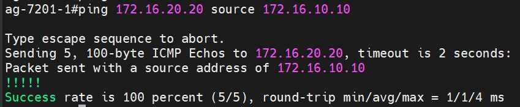
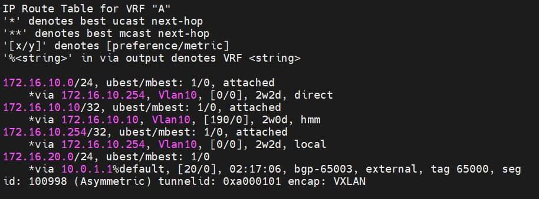
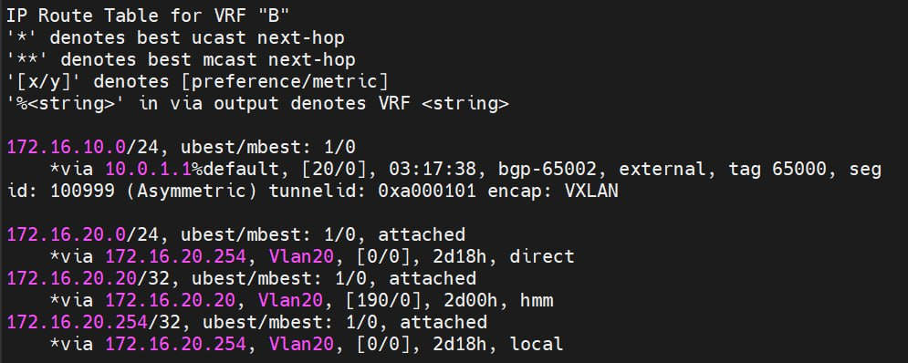

# VxLAN. Routing.

### Реализовать передачу суммарных префиксов через EVPN route-type 5.

Топология так же неизменна, 3 лифа и два спйна.

В качестве бордел лифа выступает первый лиф.
К лифу 2 подключен клиент в врф В, а к лифу 3 поключен клиент в врф А.


Приступим к натройке:

Life 1
```sh
Lif 1
vrf context A
  vni 100999
  ip route 172.16.10.0/24 Null0
  rd 65001:100999
  address-family ipv4 unicast
    route-target import 65000:100998 evpn
    route-target import 65000:100999 evpn
    route-target import 65001:100998 evpn
    route-target import 65001:100999 evpn
    route-target export 65000:100998 evpn
    route-target export 65000:100999 evpn
    route-target export 65001:100998 evpn
    route-target export 65001:100999 evpn
vrf context B
  vni 100998
  ip route 172.16.20.0/24 Null0
  rd 65001:100998
  address-family ipv4 unicast
    route-target import 65000:100998 evpn
    route-target import 65001:100998 evpn
    route-target import 65001:100999 evpn
    route-target export 65000:100998 evpn
    route-target export 65001:100998 evpn
    route-target export 65001:100999 evpn

interface Vlan10
  no shutdown
  vrf member A
  ip address 172.16.10.254/24
  fabric forwarding mode anycast-gateway

interface Vlan20
  no shutdown
  vrf member B
  ip address 172.16.20.254/24
  fabric forwarding mode anycast-gateway

interface Vlan998
  no shutdown
  vrf member B
  ip forward

interface Vlan999
  no shutdown
  vrf member A
  ip forward

interface nve1
  no shutdown
  host-reachability protocol bgp
  source-interface loopback1
  member vni 10010
    ingress-replication protocol bgp
  member vni 10020
    ingress-replication protocol bgp
  member vni 100998 associate-vrf
  member vni 100999 associate-vrf

interface Ethernet1/1
  description to_Spine1
  no switchport
  evpn multihoming core-tracking
  ip address 10.0.0.1/31
  ip ospf network point-to-point
  ip router ospf 1 area 0.0.0.0
  no shutdown

interface Ethernet1/3
  description to_Spine2
  no switchport
  evpn multihoming core-tracking
  ip address 10.0.0.11/31
  ip ospf network point-to-point
  ip router ospf 1 area 0.0.0.0
  no shutdown

interface Ethernet1/9
  no switchport
  vrf member A
  ip address 192.168.10.0/31
  no shutdown

interface loopback1
  ip address 10.0.1.1/32
  ip router ospf 1 area 0.0.0.0
line console
line vty
boot nxos bootflash:/nxos.9.3.14.bin
router ospf 1
  router-id 10.0.1.1
router bgp 65001
  router-id 10.0.1.1
  log-neighbor-changes
  address-family l2vpn evpn
    maximum-paths 10
    advertise-pip
  template peer SPINES
    remote-as 65000
    update-source loopback1
    ebgp-multihop 10
    address-family l2vpn evpn
      send-community
      send-community extended
      rewrite-evpn-rt-asn
  neighbor 10.1.1.1
    inherit peer SPINES
  neighbor 10.1.1.2
    inherit peer SPINES
  vrf A
    address-family ipv4 unicast
      network 172.16.10.0/24
      network 172.16.20.0/24
    neighbor 192.168.10.1
      remote-as 65001
      address-family ipv4 unicast
        next-hop-self
  vrf B
    address-family ipv4 unicast
      network 172.16.10.0/24
      network 172.16.20.0/24
      export-gateway-ip
    neighbor 192.168.20.1
      remote-as 65001
      address-family ipv4 unicast
        next-hop-self
evpn
  vni 10010 l2
    rd 65001:10010
    route-target import auto
    route-target import 65000:10010
    route-target export auto
    route-target export 65000:10010
  vni 10020 l2
    rd 65001:10020
    route-target import auto
    route-target import 65000:10020
    route-target export auto
    route-target export 65000:10020
```

Life 2

```sh
Life 2 

fabric forwarding anycast-gateway-mac 000e.000e.000e
vlan 1,10,20,998-999
vlan 10
  name VLAN_10
  vn-segment 10010
vlan 20
  vn-segment 10020
vlan 998
  vn-segment 100998
vlan 999
  vn-segment 100999

vrf context A
  vni 100999
  rd 65003:100999
  address-family ipv4 unicast
    route-target import 65000:100999
    route-target import 65000:100999 evpn
    route-target export 65000:100999
    route-target export 65000:100999 evpn
vrf context B
  vni 100998
  rd 65002:100998
  address-family ipv4 unicast
    route-target import 65000:100998
    route-target import 65000:100998 evpn
    route-target import 6500:100998
    route-target import 6500:100998 evpn
    route-target export 65000:100998
    route-target export 65000:100998 evpn
    route-target export 6500:100998
    route-target export 6500:100998 evpn

interface Vlan20
  no shutdown
  vrf member B
  ip address 172.16.20.254/24
  fabric forwarding mode anycast-gateway

interface Vlan998
  no shutdown
  vrf member B
  ip forward

interface Vlan999
  vrf member A
  ip forward

interface nve1
  no shutdown
  host-reachability protocol bgp
  source-interface loopback1
  member vni 10010
    ingress-replication protocol bgp
  member vni 10020
    ingress-replication protocol bgp
  member vni 100998 associate-vrf
  member vni 100999 associate-vrf

interface Ethernet1/1
  description to_Spine1
  no switchport
  evpn multihoming core-tracking
  ip address 10.0.0.3/31
  ip ospf network point-to-point
  ip router ospf 1 area 0.0.0.0
  no shutdown

interface Ethernet1/3
  description to_Spine2
  no switchport
  evpn multihoming core-tracking
  ip address 10.0.0.9/31
  ip ospf network point-to-point
  ip router ospf 1 area 0.0.0.0
  no shutdown

interface Ethernet1/47
  switchport access vlan 20

interface loopback1
  ip address 10.0.1.2/32
  ip router ospf 1 area 0.0.0.0
line console
line vty
boot nxos bootflash:/nxos.9.3.14.bin
router ospf 1
  router-id 10.0.1.2
router bgp 65002
  router-id 10.0.1.2
  log-neighbor-changes
  address-family l2vpn evpn
    maximum-paths 10
  template peer SPINES
    remote-as 65000
    update-source loopback1
    ebgp-multihop 10
    address-family l2vpn evpn
      send-community
      send-community extended
  neighbor 10.1.1.1
    inherit peer SPINES
  neighbor 10.1.1.2
    inherit peer SPINES
  vrf B
    address-family ipv4 unicast
evpn
  vni 10010 l2
    rd 65002:10010
    route-target import 65000:10010
    route-target export 65000:10010
  vni 10020 l2
    rd 65002:10020
    route-target import 65000:10020
    route-target export 65000:10020
```

Life 3 настроен аналогично Life 2, только клиент сидит в своем vrf.

Проверяем:









```sh
Life2# sh bg l2 e route-type 5
BGP routing table information for VRF default, address family L2VPN EVPN
Route Distinguisher: 65001:100998
BGP routing table entry for [5]:[0]:[0]:[24]:[172.16.20.0]/224, version 774
Paths: (2 available, best #2)
Flags: (0x000002) (high32 00000000) on xmit-list, is not in l2rib/evpn, is not i
n HW
Multipath: eBGP

  Path type: external, path is valid, not best reason: newer EBGP path, no label
ed nexthop
  Gateway IP: 0.0.0.0
  AS-Path: 65000 65001 , path sourced external to AS
    10.0.1.1 (metric 9) from 10.1.1.2 (10.1.1.1)
      Origin IGP, MED not set, localpref 100, weight 0
      Received label 100998
      Extcommunity: RT:65000:100998 RT:65000:100999 ENCAP:8 Router MAC:003a.7de9
.4ee9

  Advertised path-id 1
  Path type: external, path is valid, is best path, no labeled nexthop
             Imported to 4 destination(s)
             Imported paths list: B L3-100999 A L3-100998
  Gateway IP: 0.0.0.0
  AS-Path: 65000 65001 , path sourced external to AS
    10.0.1.1 (metric 9) from 10.1.1.1 (10.1.1.1)
      Origin IGP, MED not set, localpref 100, weight 0
      Received label 100998
      Extcommunity: RT:65000:100998 RT:65000:100999 ENCAP:8 Router MAC:003a.7de9
.4ee9

  Path-id 1 not advertised to any peer

Route Distinguisher: 65001:100999
BGP routing table entry for [5]:[0]:[0]:[24]:[172.16.10.0]/224, version 768
Paths: (2 available, best #1)
Flags: (0x000002) (high32 00000000) on xmit-list, is not in l2rib/evpn, is not i
n HW
Multipath: eBGP

  Advertised path-id 1
  Path type: external, path is valid, is best path, no labeled nexthop
             Imported to 4 destination(s)
             Imported paths list: B L3-100999 A L3-100998
  Gateway IP: 0.0.0.0
  AS-Path: 65000 65001 , path sourced external to AS
    10.0.1.1 (metric 9) from 10.1.1.1 (10.1.1.1)
      Origin IGP, MED not set, localpref 100, weight 0
      Received label 100999
      Extcommunity: RT:65000:100998 RT:65000:100999 ENCAP:8 Router MAC:003a.7de9
.4ee9

  Path type: external, path is valid, not best reason: Neighbor Address, no labe
led nexthop
  Gateway IP: 0.0.0.0
  AS-Path: 65000 65001 , path sourced external to AS
    10.0.1.1 (metric 9) from 10.1.1.2 (10.1.1.1)
      Origin IGP, MED not set, localpref 100, weight 0
      Received label 100999
      Extcommunity: RT:65000:100998 RT:65000:100999 ENCAP:8 Router MAC:003a.7de9
.4ee9

  Path-id 1 not advertised to any peer

Route Distinguisher: 65002:100998    (L3VNI 100998)
BGP routing table entry for [5]:[0]:[0]:[24]:[172.16.10.0]/224, version 769
Paths: (1 available, best #1)
Flags: (0x000002) (high32 00000000) on xmit-list, is not in l2rib/evpn, is not i
n HW
Multipath: eBGP

  Advertised path-id 1
  Path type: external, path is valid, is best path, no labeled nexthop
             Imported from 65001:100999:[5]:[0]:[0]:[24]:[172.16.10.0]/224
  Gateway IP: 0.0.0.0
  AS-Path: 65000 65001 , path sourced external to AS
    10.0.1.1 (metric 9) from 10.1.1.1 (10.1.1.1)
      Origin IGP, MED not set, localpref 100, weight 0
      Received label 100999
      Extcommunity: RT:65000:100998 RT:65000:100999 ENCAP:8 Router MAC:003a.7de9
.4ee9

  Path-id 1 not advertised to any peer
BGP routing table entry for [5]:[0]:[0]:[24]:[172.16.20.0]/224, version 772
Paths: (1 available, best #1)
Flags: (0x000002) (high32 00000000) on xmit-list, is not in l2rib/evpn, is not i
n HW
Multipath: eBGP

  Advertised path-id 1
  Path type: external, path is valid, is best path, no labeled nexthop
             Imported from 65001:100998:[5]:[0]:[0]:[24]:[172.16.20.0]/224
  Gateway IP: 0.0.0.0
  AS-Path: 65000 65001 , path sourced external to AS
    10.0.1.1 (metric 9) from 10.1.1.1 (10.1.1.1)
      Origin IGP, MED not set, localpref 100, weight 0
      Received label 100998
      Extcommunity: RT:65000:100998 RT:65000:100999 ENCAP:8 Router MAC:003a.7de9
.4ee9

  Path-id 1 not advertised to any peer
```

Цели считаю достигнатыми.